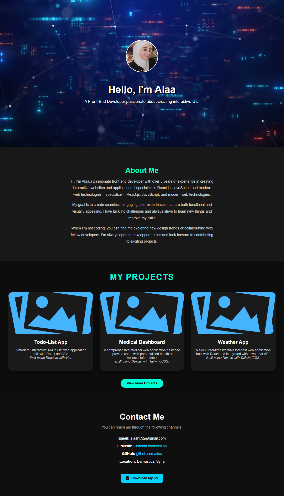

# 🧠 Alaa Alhaj - Front-End Portfolio

Welcome to my personal portfolio website built with **React.js** ✨  
This project showcases my skills, personal projects, and contributions to real-world applications in a sleek one-page layout.

---

## 📁 Project Structure

```
src/
├── components/
│   ├── Hero.jsx
│   ├── About.jsx
│   ├── Skills.jsx
│   ├── Projects.jsx
│   ├── MoreProjects.jsx
│   ├── Contact.jsx
│   └── Header.jsx
├── pages/
│   ├── Home.jsx
│   ├── ProjectDetails.jsx
│   └── NotFound.jsx
├── public/
│   └── images/
├── App.js
└── index.js
```

---

## 🚀 Features

- ✅ **Smooth one-page scrolling experience**
- 🎯 Section-based navigation with animated transitions
- 📱 Fully responsive layout with **hamburger menu**
- 🌌 Animated background in Hero section using Vanta.js and Three.js
- 💡 Split project sections:
  - Projects I fully developed
  - Projects I contributed to (like *Medicus Wellbeing Quiz*, *Smart Reports*)
- 📄 Project Details view with image + description
- ❌ Custom 404 Not Found page
- 🌈 Framer Motion animations
- 🎨 Custom favicon + internal navigation header

---

## 🛠️ Built With

- ⚛️ [React.js](https://reactjs.org/)
- 💫 [Framer Motion](https://www.framer.com/motion/)
- 🧭 [React Router](https://reactrouter.com/)
- 🧩 [Lucide Icons](https://lucide.dev/)
- 🎨 CSS3 & custom styles

---

## 📦 Installation

To run locally:

```bash
git clone https://github.com/alaa-alhajj/alaa-portfolio.git
cd alaahj-portfolio
npm install
npm start
```

---

## 📸 Preview



---

## 👩‍💻 Author

**Alaa Alhaj**  
🌍 Front-End Developer | Passionate about clean UI & smooth UX  
📫 [LinkedIn](https://www.linkedin.com/in/alaa-alhaj/)  
💻 [GitHub](https://github.com/alaa-alhajj/)

---

## 📄 License

This project is licensed under the MIT License – feel free to use and modify.
